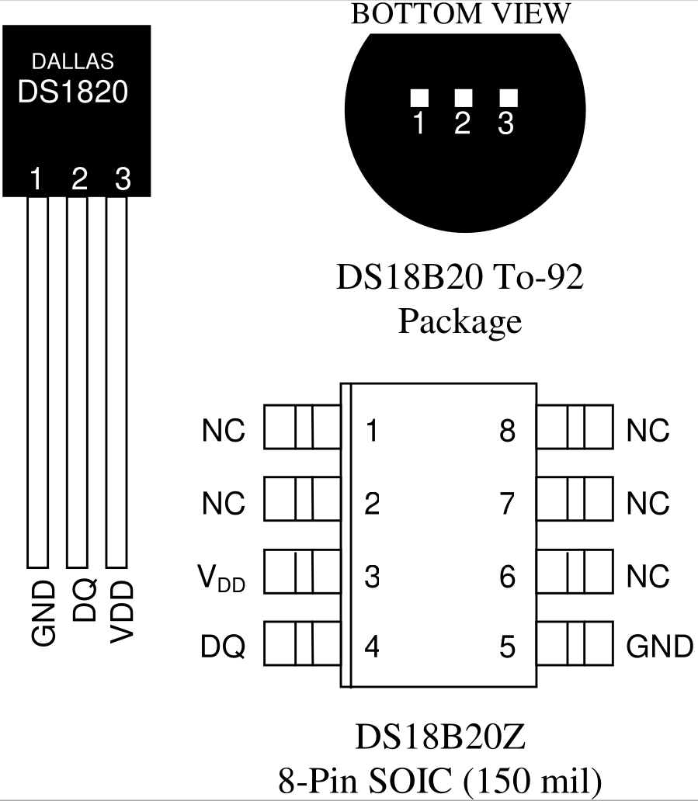
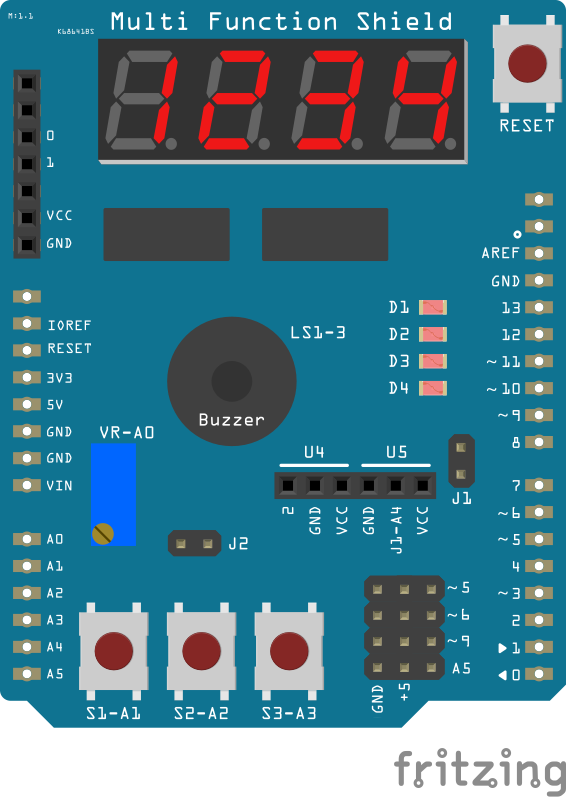
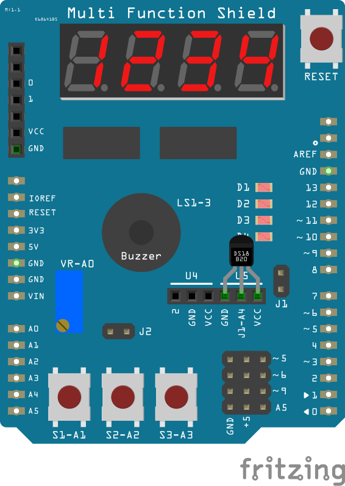

# arduino-termometro
## Termômetro com Arduino

Termômetro baseado no sensor DS18B20 (https://cdn.sparkfun.com/datasheets/Sensors/Temp/DS18B20.pdf)

Multifunction Shield (https://github.com/coderfls/Arduino_MultiFunctionShield)

Esquemático Completo

VS-Code Codespace
e uma linha Web

Mais uma linha Codespace